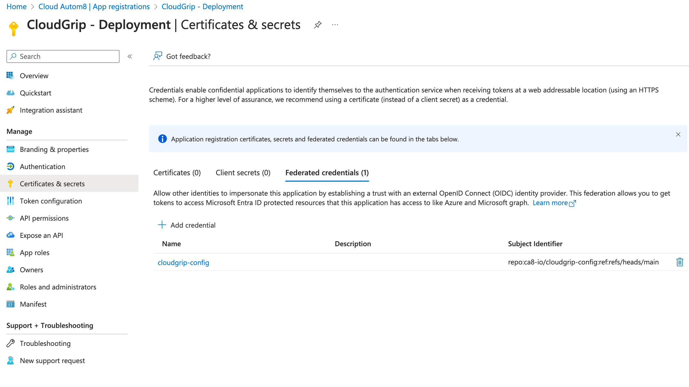

# Configuration

## Intro

Once onboarding has completed and the *"CloudGrip - Deployment"* Service Principal is created, the configuration for Github or Azure DevOps can begin.

## GitHub

For using Github as CICD system we need to setup some variables in order to start using it. Credential delegation setup is already done. You can verify that the delegated credential setup is configured in Entra Id under app registrations. There is the *"CloudGrip - Deployment"* app registration:


Next step is to configure the variables in Github Action variables. We need to create variables for the tenant id and the application id. Create 2 variables named:

|Variable Name | Description|
|-|-|
|CLOUDGRIPAZURECLIENTID | This is the Application (client) ID of the CloudGrip - Deployment app|
|CLOUDGRIPAZURETENANTID | This is the Directory (tenant) ID of the CloudGrip - Deployment app|

For each supply the value that corresponds with your environment. Eventually the variables should look like this and you can reach the variable configuration via ```settings -> secrets and variables -> actions -> Repository Variables```:


## Azure DevOps

For Azure Devops the steps and documentation will arrive soon.
