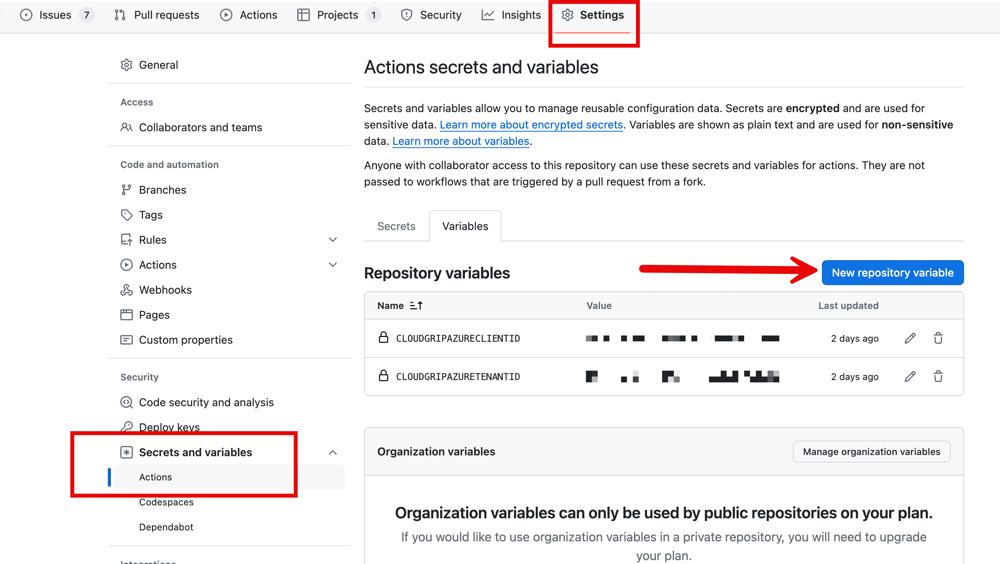
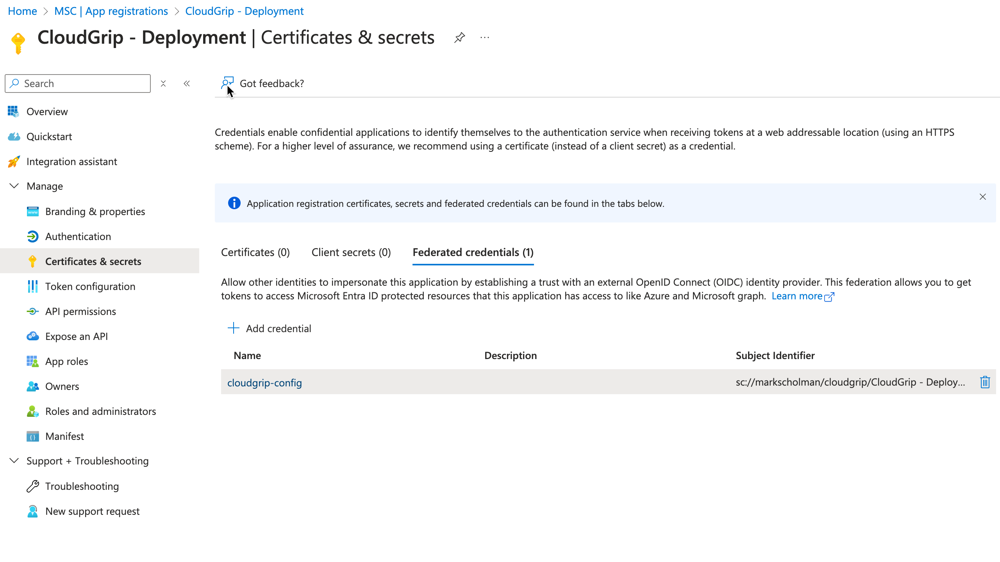
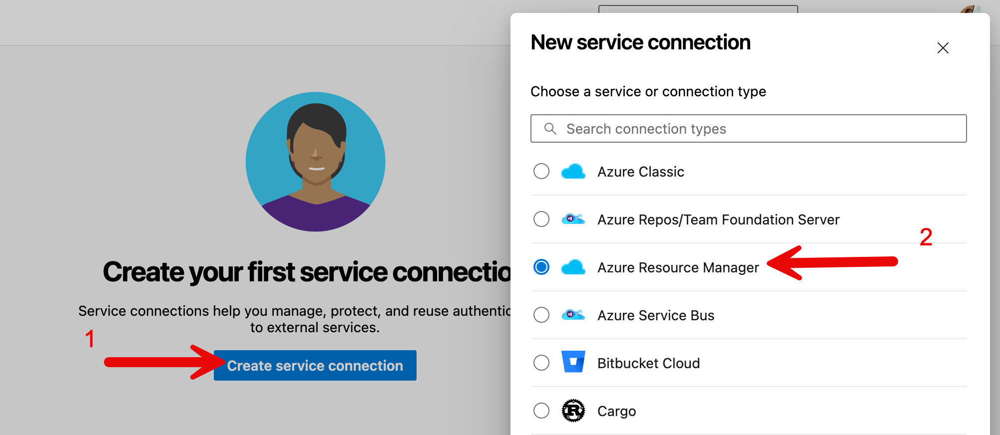
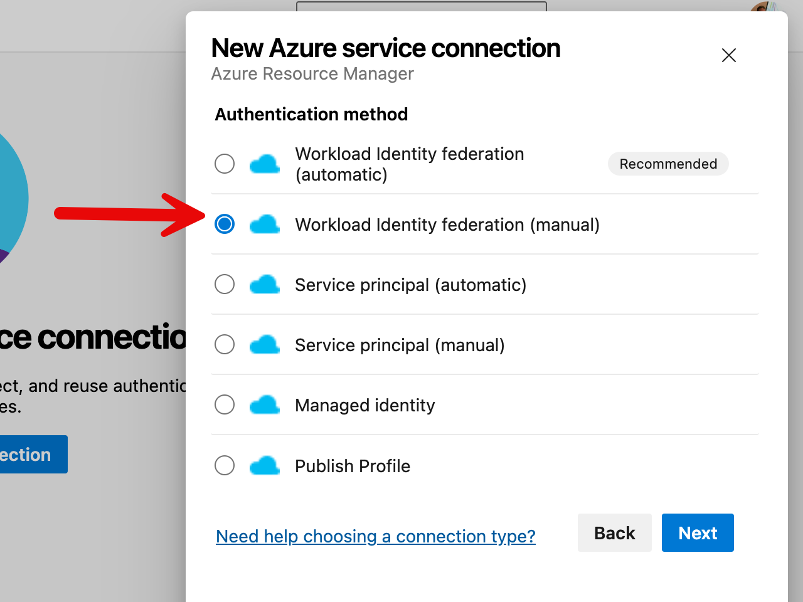
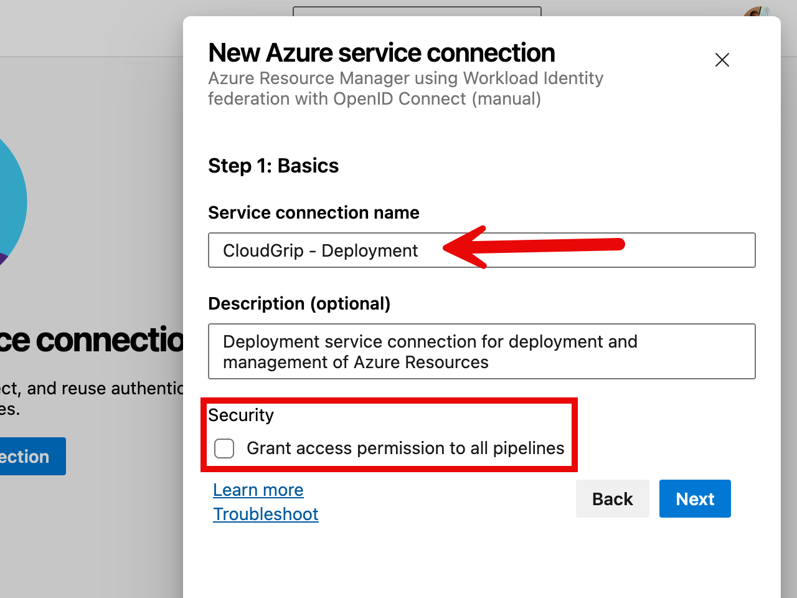
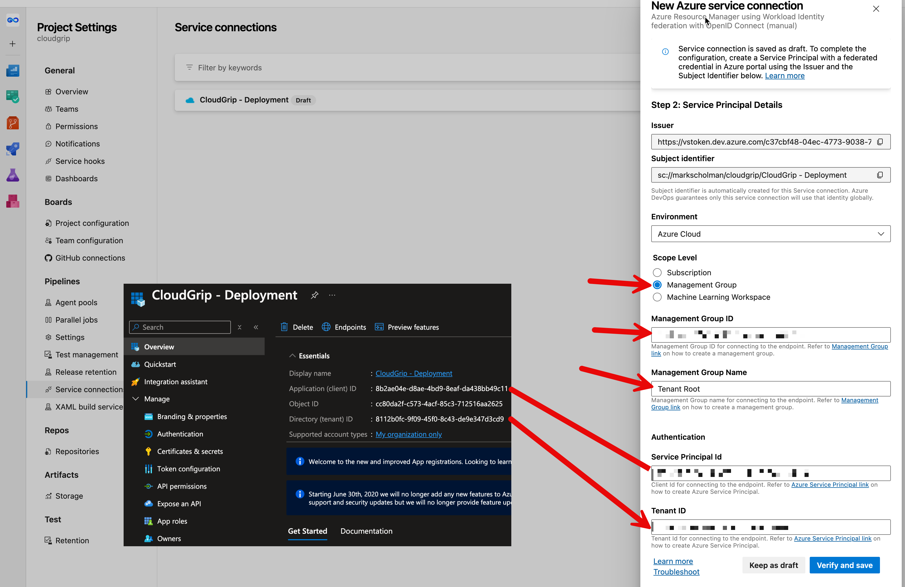

# Configuration

## Intro

Once onboarding has completed and the *"CloudGrip - Deployment"* Service Principal is created, the configuration for Github or Azure DevOps can begin. Please follow the GitHub or Azure DevOps section below based on what you are using.

> If manual creation of the SPN is performed, the app registration name might vary in the documentation below.

## GitHub

For using Github as CICD system we need to setup some variables in order to start using it. Credential delegation setup is already done. You can verify that the delegated credential setup is configured in Entra Id under app registrations. There is the *"CloudGrip - Deployment"* app registration:


Next step is to configure the variables in Github Action variables. We need to create variables for the tenant id and the application id. Create 2 variables named:

|Variable Name | Description|
|-|-|
|CLOUDGRIPAZURECLIENTID | This is the Application (client) ID of the CloudGrip - Deployment app|
|CLOUDGRIPAZURETENANTID | This is the Directory (tenant) ID of the CloudGrip - Deployment app|

For each supply the value that corresponds with your environment. Eventually the variables should look like this and you can reach the variable configuration via ```settings -> secrets and variables -> actions -> Repository Variables```:


## Azure DevOps

When using Azure Devops as CICD system we need to setup a service connections. Credential delegation setup is already done. You can verify that the delegated credential setup is configured in Entra Id under app registrations. There is the *"CloudGrip - Deployment"* app registration:


The service connection setup is explained with the following steps.
In Azure DevOps go to your CloudGrip project and in the left bottom corner choose ```Project Settings```, next under the Pipelines section search for ```Service Connections``` and select it. You either have the option to ```Create New Service Connection``` in the top right corner or in the main screen select ```New Service Connection```. In the New Service Connection wizard choose ```Azure Resource Manager```:


Choose Workload Identity Federation (Manual) and click next:


Define the Service connection name. This should be: ```CloudGrip - Deployment``` exact as written. If you cannot comply with this name you have to update the application registration federated credential settings with the correct Subject Identifier. This will then change to the name you have chosen.

Leave the checkbox empty under the security settings empty and choose next:


Finally fill in the other settings. The environment is ```Azure Cloud```. CloudGrip is managing Azure by default from the root, so choose management group and fill in the management group id and name. By default the Root Management Group Id is the tenant Id and the name is 'Tenant Root Group' Finally fill in the application Id and the Tenant Id under the authentication settings and choose verify and safe. If you have choosen a different name for the service connection you can save it as draft and then update the settings in the SPN section. Once that is done you can go back to the service connection and validate the connection.


Now the connection is ready for use in Azure DevOps Pipelines.
