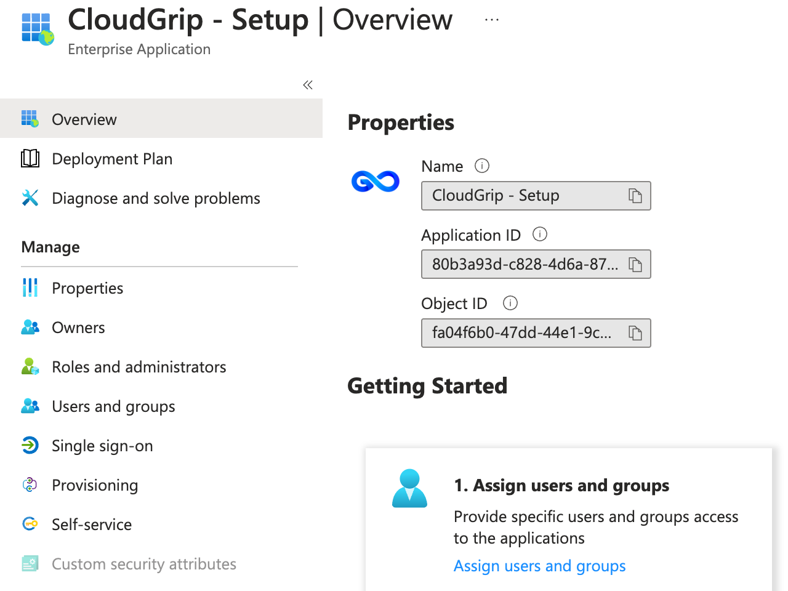
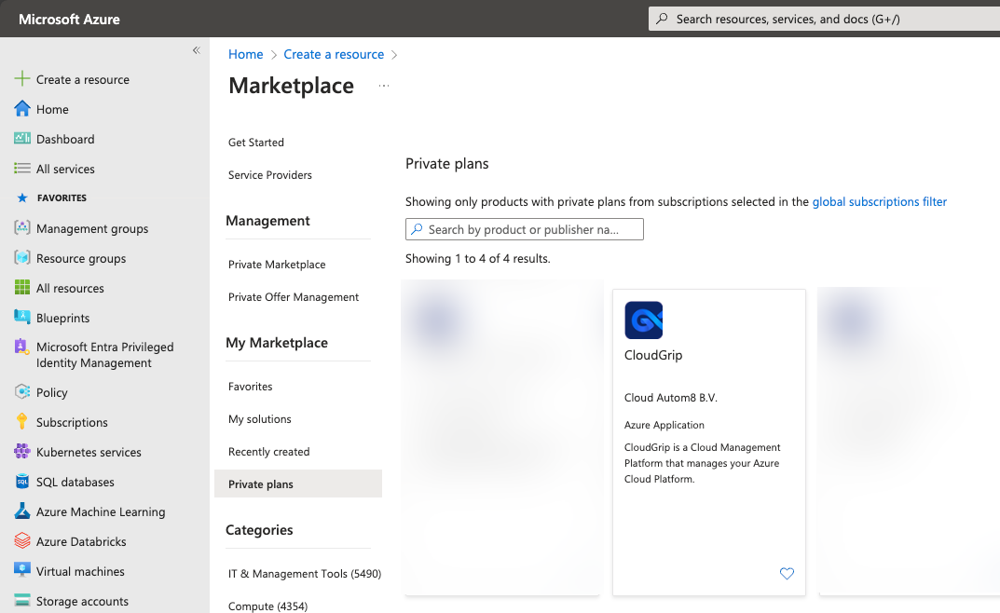

# Installation

## Install PowerShell Module

In order to get started with CloudGrip download the supporting Bootstrap PowerShell [module](../assets/pwsh/CA8.Bootstrap_0.1.0.zip) and import it in your PowerShell session:

```powershell
#Assuming that the downloaded module is in the same folder as the script. Adjust otherwise.
Expand-Archive -Path './CA8.Bootstrap_0.1.0.zip' -DestinationPath './CA8.Bootstrap_0.1.0'
Import-Module -Name ./CA8.Bootstrap_0.1.0/CA8.Bootstrap.psd1 -Verbose

```

It recommended that you create a new folder in your repositories or source folder structure where you usually clone or initiate new projects in. In that folder create a start.ps1 and copy the content above in it.

This snippet will import the necessary cmdlets in order to get the repository for CloudGrip setup and set the permissions in Azure correctly for the pipelines.

## Scaffolding CloudGrip structure

The next step is to create a scaffolding folder structure for your config store.

```powershell
#To create scaffolding for Azure DevOps
New-CA8CloudGripSetup -Path .\cloudgrip-config-gh -DevOpsSystem GitHub 

#To create scaffolding for Github
New-CA8CloudGripSetup -Path .\cloudgrip-config-azd -DevOpsSystem AzureDevOps

```

## Configure SPN and Azure Permissions

The final step for installation is to setup the *"CloudGrip - Setup"* Service Principal in your tenant and configure the right permissions for it.
This SPN *once configured correctly* can setup the *"CloudGrip - Deployment"* service principal and can maintain and update the managed application deployed in your tenant that runs the CloudGrip software.

> You should be elevated to Global Administrator role to run the cmdlet below

```powershell

#Create a new service principal and configure permissions for Azure
#Replace '00000000-0000-0000-0000-000000000000' with your tenant id.
 
Register-CA8CloudGripSPN -TenantId '00000000-0000-0000-0000-000000000000'

# > "CloudGrip SPN registered and permissions configured"
```

The previous step will only configure the *"CloudGrip - Setup"* service principal. Once cmdlet returns ```"CloudGrip SPN registered and permissions configured"``` you can continue with deployment of the CloudGrip Azure MarketPlace item or if already available use the CloudGrip self service portal to initiate the deployment setup.

The Service Principal in Entra Id is found under enterprise applications and should look like this:

*application id and object id may vary*

> You can manually configure permissions if needed. Please refer to the manual permissions setup.

## Deploy CloudGrip from the Azure Marketplace

From the Azure Portal, go to the market place and search for CloudGrip. Next fill in the parameters and deploy CloudGrip into your environment.


