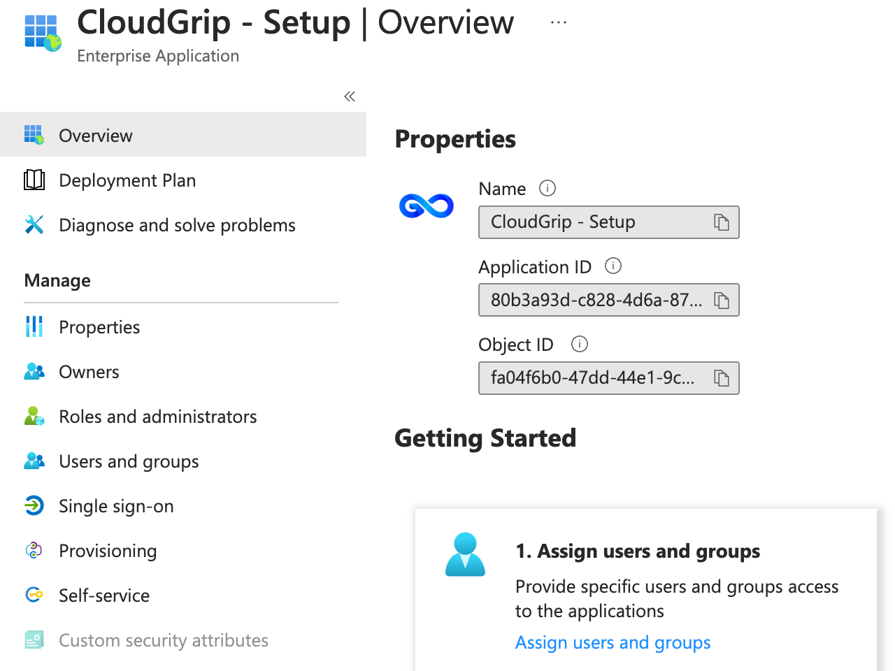

# Getting Started

In order to get started with CloudGrip couple of steps need to be performed.
In a nutshell it contains these phases:

- Create GitHub or Azure DevOps repository for CloudGrip code base.
- Download and install bootstrap PowerShell module.
- Configure SPN in your tenant and provide permissions.
- Create tenant structure in repository.

After the install steps the situtation achieved is as following. A folder structure created for CloudGrip codebase:

An SPN created for setup, maintenance and updates that should look like this:

*application id and object id may vary*
